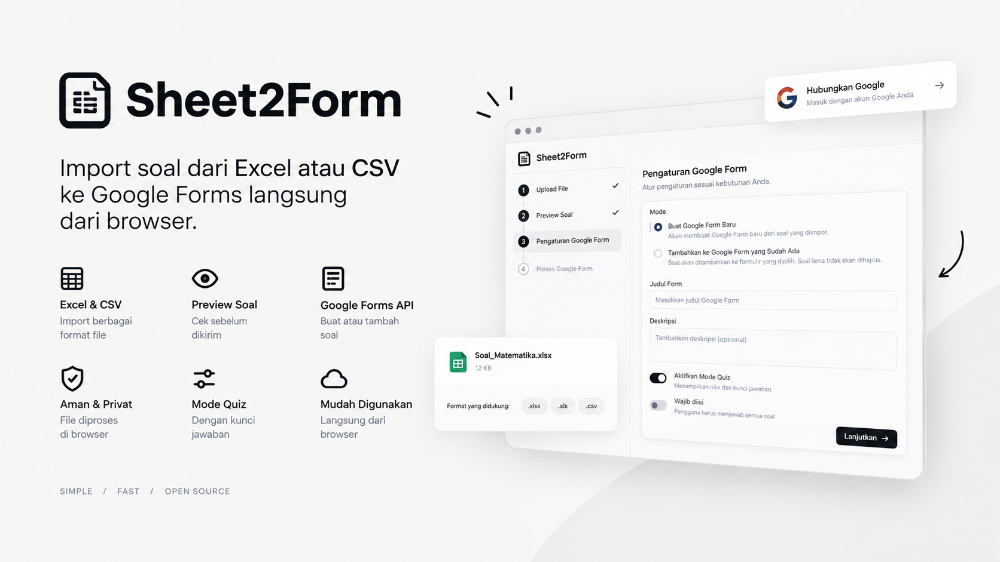

# Sheet2Form

Import soal dari Excel atau CSV ke Google Forms langsung dari browser.

## Live Demo

https://garinarka.github.io/sheetto.form/

## Features

- Import soal dari `.xlsx`, `.xls`, dan `.csv`
- Preview soal sebelum dikirim
- Mendukung pilihan ganda dan uraian
- Mendukung mode quiz
- Membuat Google Form baru
- Menambahkan soal ke Google Form yang sudah ada
- Mempertahankan soal lama pada mode existing
- Progress indicator saat proses berlangsung
- Pemrosesan file di browser

## How to Use

1. Buka [live demo](https://garinarka.github.io/sheetto.form/).
2. Hubungkan akun Google.
3. Upload file Excel atau CSV.
4. Periksa preview soal.
5. Pilih:
   - Buat Google Form baru, atau
   - Tambahkan soal ke Google Form existing.
6. Atur judul, deskripsi, dan mode quiz.
7. Klik tombol proses Google Form.
8. Buka link Google Form yang dihasilkan.

## Excel Format

Gunakan kolom berikut:

| Question           | Option 1 | Option 2 | Option 3 | Option 4 | Answer  |
| ------------------ | -------- | -------- | -------- | -------- | ------- |
| Ibukota Indonesia? | Jakarta  | Bandung  | Surabaya | Medan    | Jakarta |

Untuk soal uraian, kolom pilihan dapat dikosongkan.

Header alternatif bahasa Indonesia yang didukung:

- Question / Pertanyaan / Soal
- Option 1 / Pilihan 1 / A
- Option 2 / Pilihan 2 / B
- Option 3 / Pilihan 3 / C
- Option 4 / Pilihan 4 / D
- Answer / Correct Answer / Jawaban / Kunci Jawaban

## Privacy

File Excel dan CSV diproses di browser pengguna.

Aplikasi tidak membutuhkan upload file ke server aplikasi.

Aplikasi menggunakan Google OAuth dan Google Forms API untuk membuat atau mengubah Google Form yang dipilih pengguna.

## Local Development

Untuk menjalankan project secara lokal:

### Google OAuth Setup

1. Buat project di Google Cloud.
2. Aktifkan Google Forms API.
3. Konfigurasikan OAuth consent screen.
4. Tambahkan scope:

   `https://www.googleapis.com/auth/forms.body`

5. Buat OAuth Client ID tipe Web application.
6. Tambahkan origin lokal dan origin GitHub Pages.
7. Salin `config.example.js` menjadi `config.js`.
8. Isi Client ID pada `config.js`.

Contoh:
```js
window.GOOGLE_CONFIG = {
  clientId: "YOUR_CLIENT_ID.apps.googleusercontent.com",
};
```

### Install dependency

```bash
npm install
```

### Jalankan Tailwind dalam mode watch

```bash
npm run dev
```

### Build production

```bash
npm run build
```

## Tech Stack

* HTML

* JavaScript

* Tailwind CSS

* SheetJS

* Google Identity Services

* Google Forms API

* GitHub Pages

## License

Sheet2Form adalah open-sourced project yang dilisensikan di bawah [MIT license](https://opensource.org/licenses/MIT).